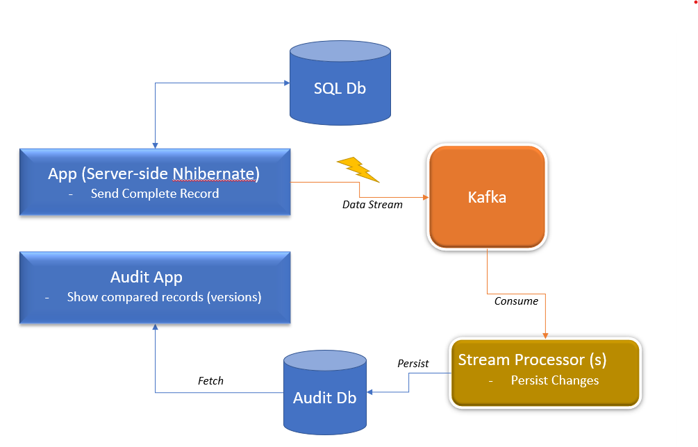
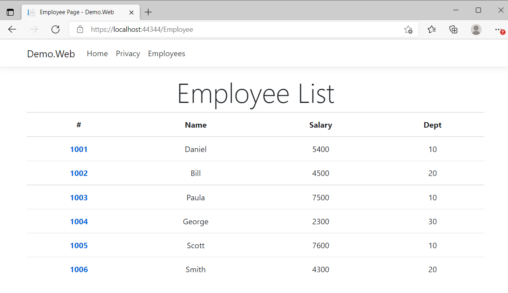
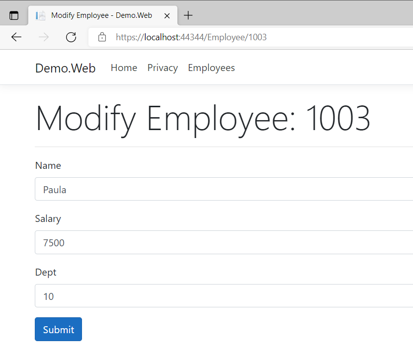
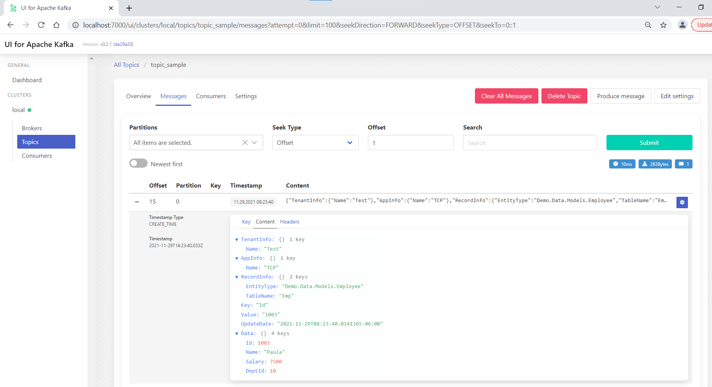
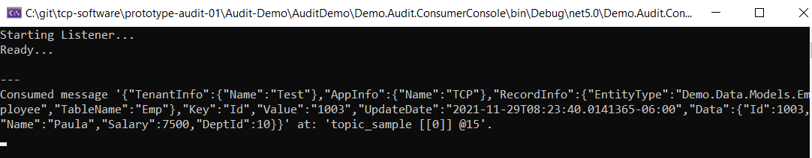
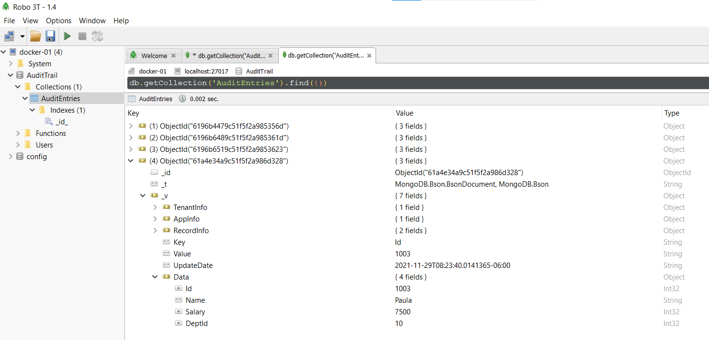
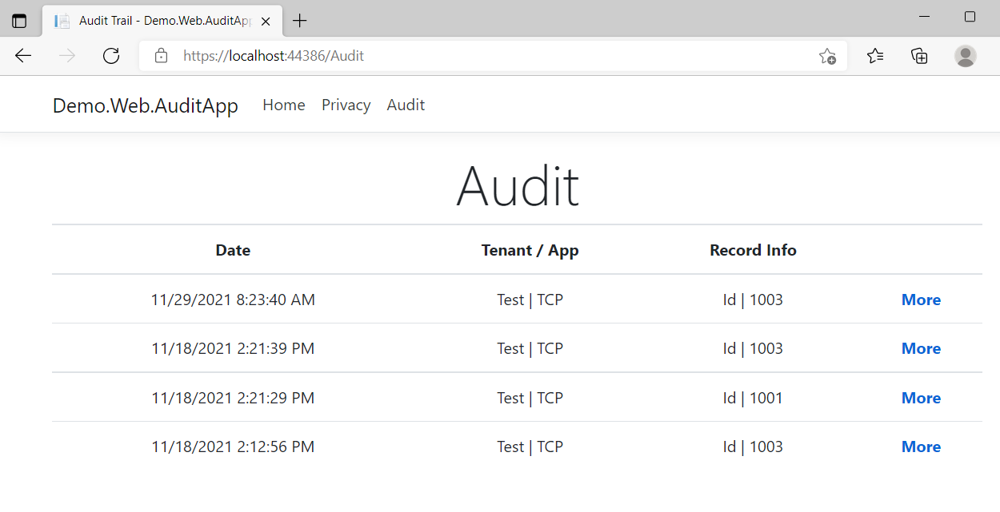
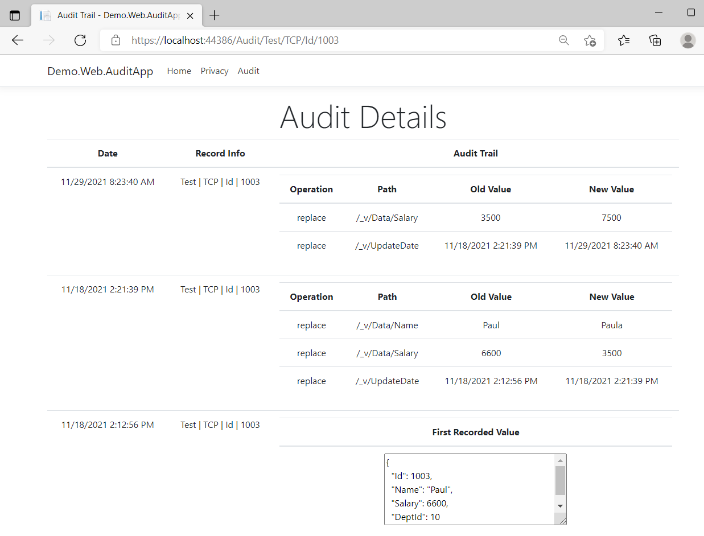

### What do you need

- Docker Desktop
  - to fire up following containers
    - SQL Server
    - Kafka
    - MongoDB
- VS 2019 updated to .NET 5

### Architecture

### Brief

- `Demo.Web` (ASP.NET Core) app works with NHibernate and uses SQL Server as data storage. It publishes any record changes (grabbed through `DummyPostUpdateEventListener` class) to Kafka (using `KafkaAuditService` class).
- `Demo.Audit.ConsumerConsole` (console app) acts as Kafka listener (consumer) and waits for record changes or messages (published by `Demo.Web`). Once messages are received, they will be pushed through MongoDB (using `Demo.MongoDb`).
- `Demo.Web.AuditApp` fetches the history of messages directly from MongoDB (using `Demo.MongoDb`)

### How to run

- Open PowerShell and go to `prototype-audit-01\Audit-Demo\docker\ms-sql-db`
- Execute following commands to start SQL Server instance with some dummy data

  > .\start-db-step-01.ps1
  > .\start-db-step-02.ps1

- (optional) You should be able to use MS SQL Server Management Studio to connect to above instance (check `start-db--variables.ps1` for more info)
- Open PowerShell, go to `prototype-audit-01\Audit-Demo\docker\kafka` and execute following:

  > .\start.bat

- Wait for few min (Kafka and Kafka-UI gets loaded).
- Want to know how Kafka is configured? Check `kafka-docker-compose.yml `
- Open browser, point to `http://localhost:7000` and ensure it is working (or wait till it gets up and running).
- Open PowerShell, go to `prototype-audit-01\Audit-Demo\docker\mongo-db` and execute following:

  > .\start.bat

- (optional) You can use your favorite tool to connect to MongoDB data (I use Robo 3T). Check `.env` file for configuration.

- Now that all respective services are up and running, open `AuditDemo.sln` in Visual Studio and build it.
- Ensure `Demo.Audit.ConsumerConsole`, `Demo.Web` and `Demo.Web.AuditApp` are Startup Projects and press F5
- In the browser (of Demo.Web), click on "Employees" in the Navigation Bar and play with data.
- In the browser (of Demo.Web.AuditApp), click on "Audit" and check the history/trail.

### How to cleanup

- Stop VS debugging / executions
- Execute "cleanup" scripts in each of the sub-folders in `docker` folder. These will stop all containers, remove all network bridges, volumes, images etc.

### Screenshots

#### Some data

#### Play with data

#### Data captured in Kafka

#### Kafka consumer receiving data

#### Data pushed to MongoDb

#### Entries in Audit App

#### History of Entry

