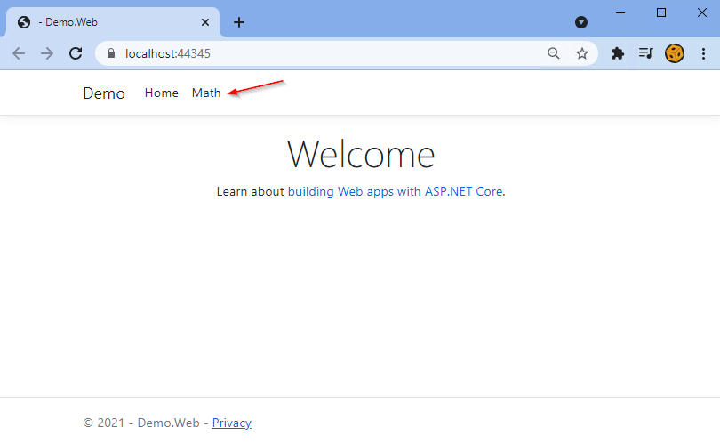
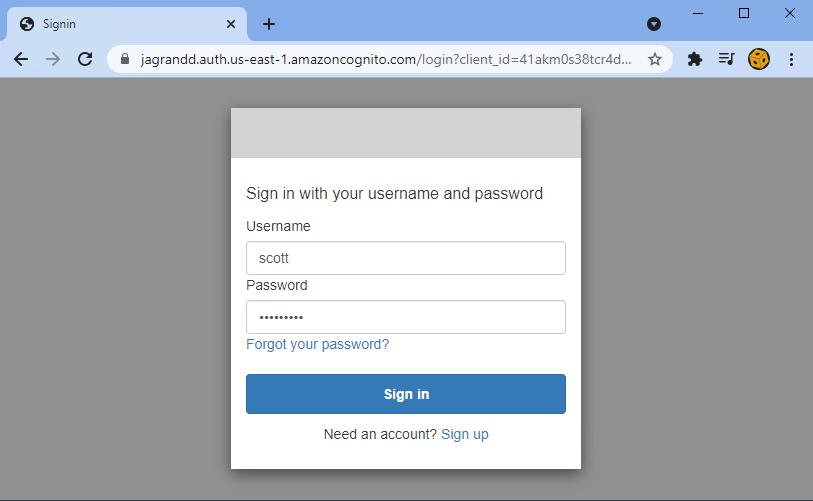
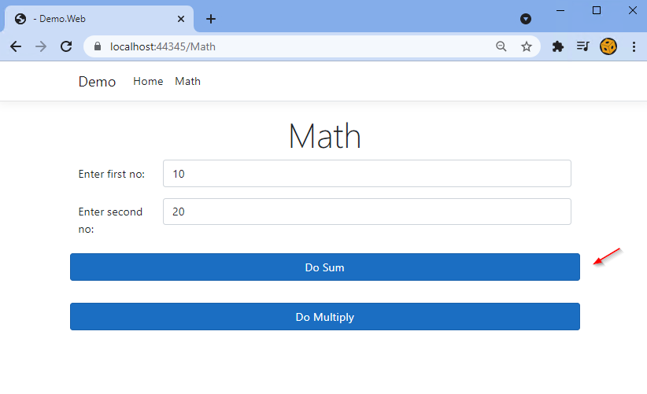
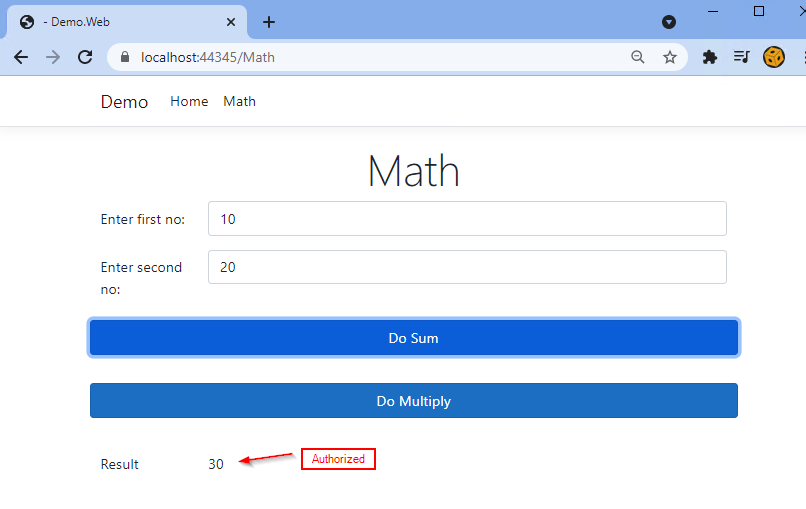
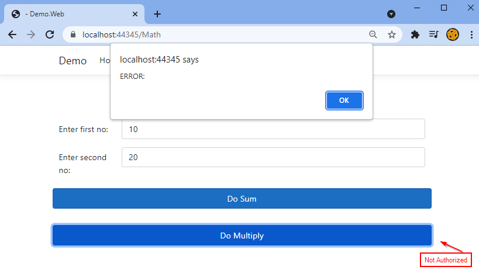
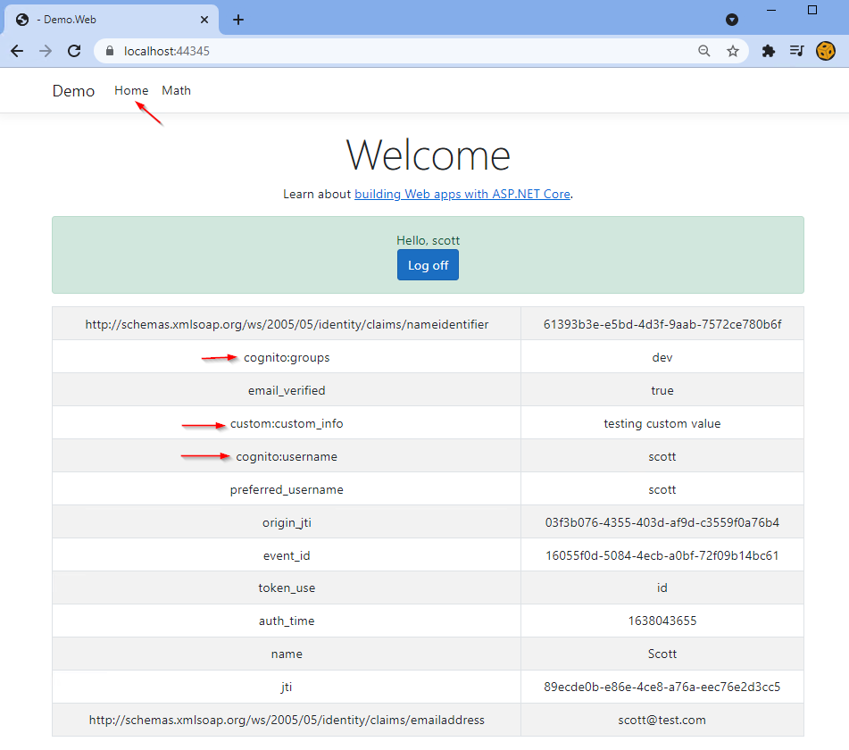
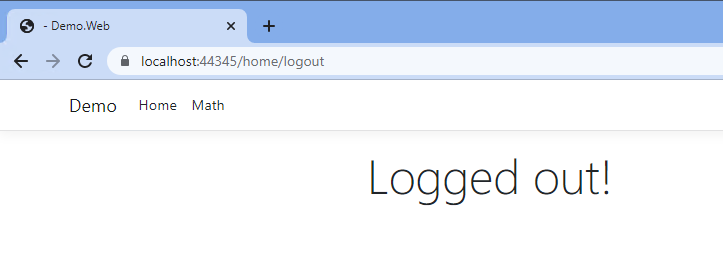

### Features

- Demonstrates both authentiation / authorization using AWS Cognito and ASP.NET Core 5s
- Uses AWS Cognito UI for sign-in 
- Uses AWS Cognito User Pool (for users and user groups)
- Uses AWS Cognito Users for identity
- Uses AWS Cognito User Groups for roles
- No AWS libraries used (only uses Microsoft .NET Core libraries and generic OIDC)
- "Sign-in" kicks in when accessing any controller/action with "Authorize" attribute
- Demonstrates on how to fetch tokens (in Startup.cs, for now)
- Demonstrates Logout from both current app and AWS server-side

### Screenshots

### AWS Cognito config / steps

Created user pool (jag.dev) with following details (deleted user pool / app client after this demo)

- Sign-in Options: User Name, Email (no phone)
  - Can use preferred user name
- Optional MFA using Authenticator apps
- Self-service account recovery enabled, delivery method: email only
- Self-service sign-up enabled
- Cognito-assisted verification and confirmation enabled 
  - cognito automatically sends messages to verify and confirm
  - Attributes to verify - send email message, verify email address
- Required Attributes - name, preferred_username
- Custom attributes - custom_info
- Email: Send email with Cognito (50 emails a day)
- Pool name: generic-pool
  - User Pool Id: us-east-1_apGA6C3Hy (after pool created)
  - https://cognito-idp.us-east-1.amazonaws.com/us-east-1_apGA6C3Hy/.well-known/openid-configuration
	  - Using https://cognito-idp.{region}.amazonaws.com/{userPoolId}/.well-known/openid-configuration
- Cognito domain - https://jagrandd.auth.us-east-1.amazoncognito.com
- Initial App Client
  - App Type: Public Client 
    - Public client: A native, browser or mobile-device app. Cognito API requests are made from user systems that are not trusted with a client secret.
    - Confidential client: A server-side application that can securely store a client secret. Cognito API requests are made from a central server.
    - Other: A custom app. Choose your own grant, auth flow, and client-secret settings.
  - App client name: app-default
    - ClientID: 41akm0s38tcr4d9fmtnnn5ng6d (after pool created)
    - Client Secret: 17j5jkvpqa48as8d16tj5bg61k8v66616jm40d8vvkd4i6ktr048
  - Allowed callback URLs:
    - https://localhost:44345
    - https://localhost:44345/signin-oidc
    - https://www.getpostman.com/oauth2/callback 
  - Allowed sign-out URLs:
    - https://localhost:44345/home/logout
  - Authentication flows enabled:
    - ALLOW_ADMIN_USER_PASSWORD_AUTH
    - ALLOW_CUSTOM_AUTH
    - ALLOW_USER_PASSWORD_AUTH
    - ALLOW_USER_SRP_AUTH (secure remote protocol)
    - ALLOW_REFRESH_TOKEN_AUTH
  - Refresh token expiration - 30 days
  - Access / id token expiration - 60 min
  - Enabled token revocation
  - Enabled prevent user existence errors
  - Identity Providers - Cognito user pool
  - OAuth Grant Type: Authorization code grant, Implicit grant
  - OpenID Connect scopes: OpenID, Phone, Email, Profile (must include OpenID for all)
- Users 
  - scott/Scott123?
  - george/George123?
- User Group / Roles
  - "dev" assigned to "scott"
  - "seniordev" assigned to "george"
