# How to test MCP Server

NOTE:

- tested on windows with node.js based mcp server
- ensure `rest-api-node-js` is running at http://localhost:3000

### Steps

- create `.env` from `.env.dev` (or just rename!)
- run following command
- the one we tested was with this version `npx @modelcontextprotocol/inspector@0.16.8`. You can also try with the latest.

```
npx @modelcontextprotocol/inspector
```

- We can also install it globally and access it as follows:

```
npm install -g @modelcontextprotocol/inspector
mcp-inspector
```

- add the mcp server and test it as follows:

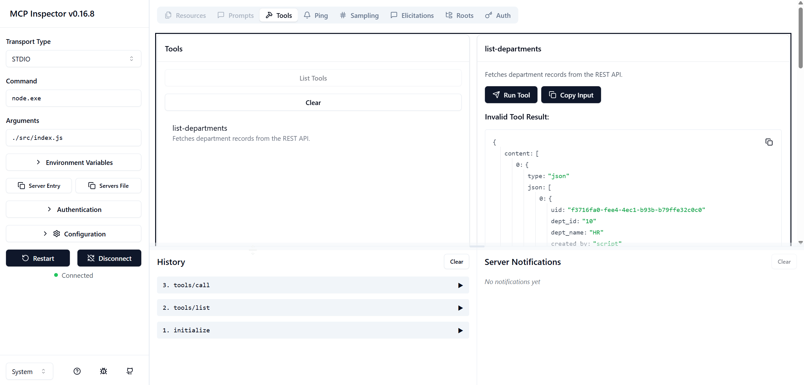

### Claude Desktop Specific

- Open Claude Desktop | Settings | Developer | Edit Config

```
{
  "mcpServers": {
    "demo-mcp-server": {
      "command": "C:/...../mcp-samples/01-end-to-end/src/mcp-server/claude-start-mcp.bat"
    }
  }
}
```

- Quit and reopen Claude Desktop
- Now, you can chat with Claude Desktop as follows:

#### Chat related to Departments

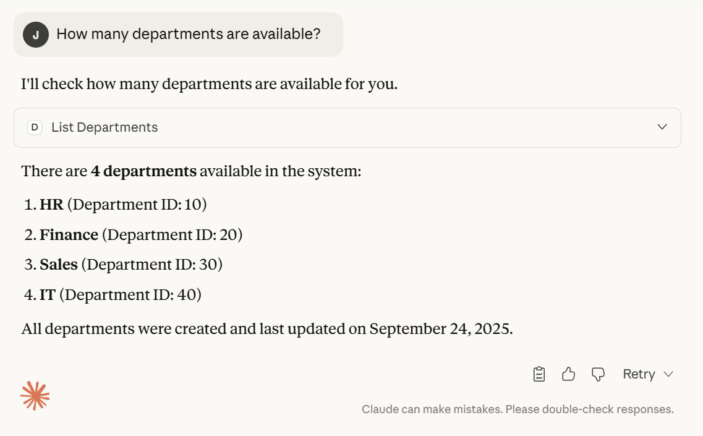

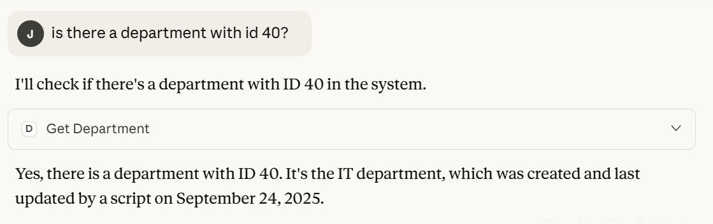

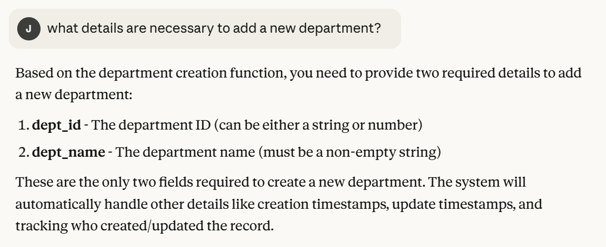

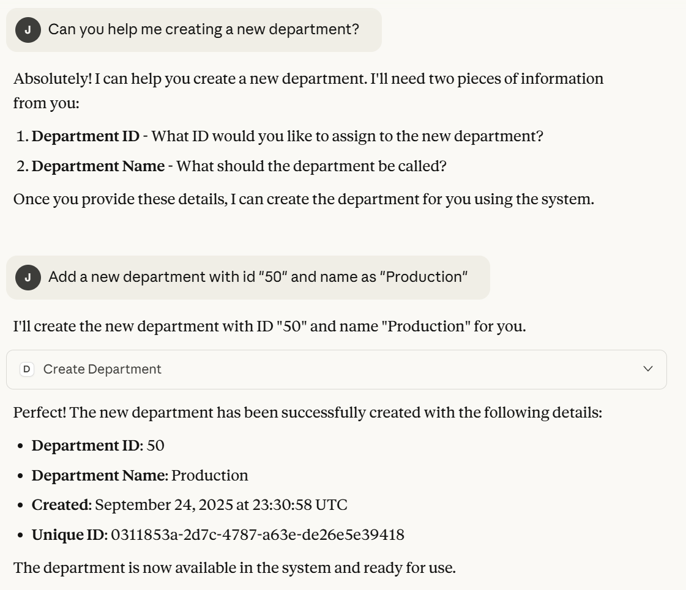

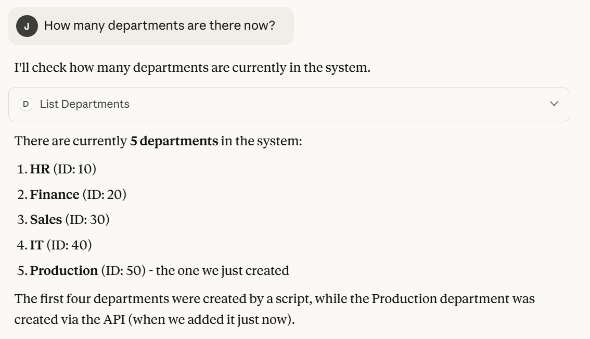

#### Chat related to Employees

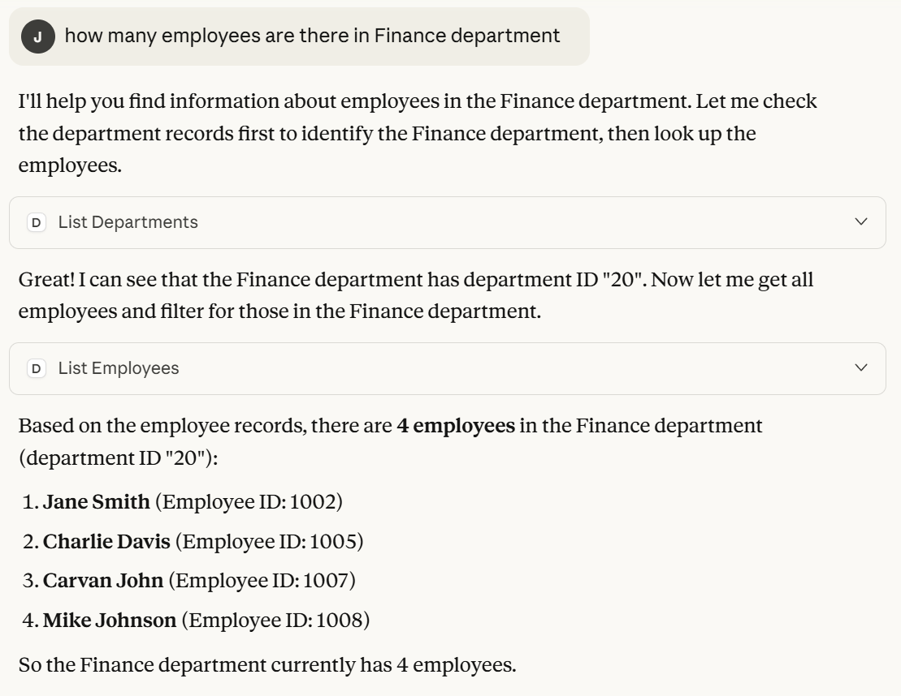

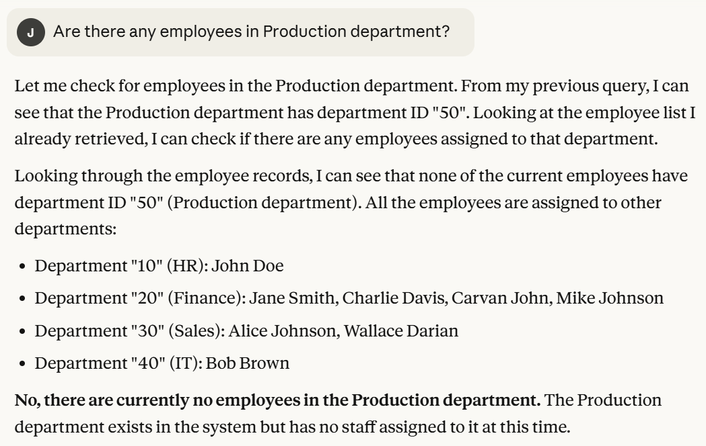

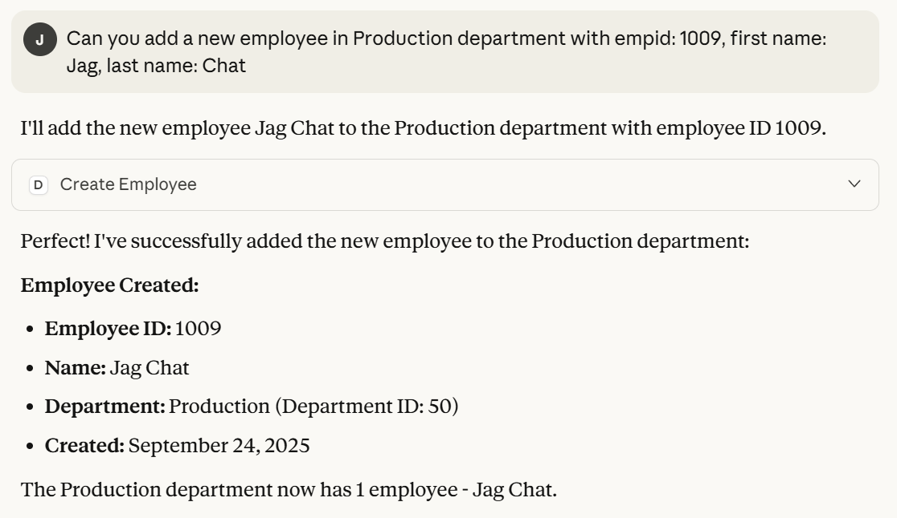

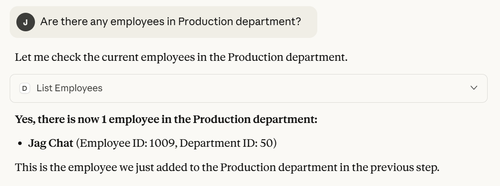

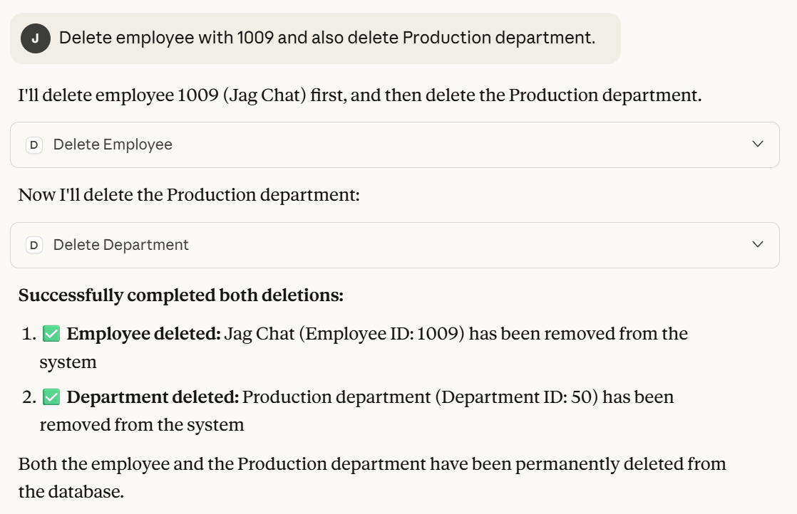

#### Chat related to Addresses

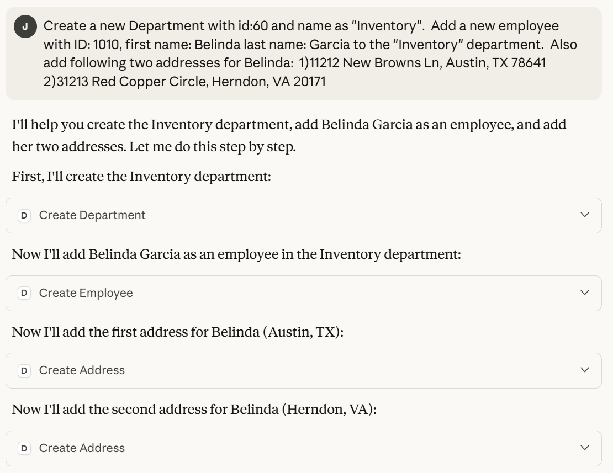
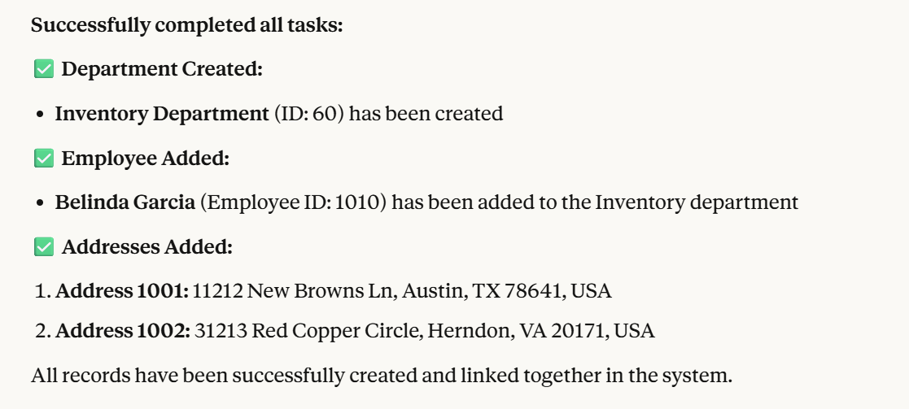
